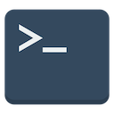

# Quarkus Sample CLI

[](https://sonarcloud.io/summary/new_code?id=fabricepipart1a_quarkus-java-sample-cli)
[](https://sonarcloud.io/summary/new_code?id=fabricepipart1a_quarkus-java-sample-cli)
[](https://sonarcloud.io/summary/new_code?id=fabricepipart1a_quarkus-java-sample-cli)

## Why a CLI?



We needed to have a product that is fast and easy to maintain. And groovy code can only run in Jenkins. Also, Pipeline
code is well known to be tedious to code and particularly to test. Java code on the other side is mastered by many
developers and Digital, is easy to maintain, code and test locally. Plus Java has a very complete ecosystem of libraries
that can help you achieve almost anything. The idea was to introduce a Java _Command Line Interface_ (CLI).

CLIs are easy to use. You just need a terminal to use them. CLIs are easy to learn and provide a convenient help. CLIs
are Multi channel: you can use them on your laptop, in a docker container, in your automations, in your CI...

OK coding in Java is great. OK CLIs are great. But that CLI had to be packaged as a simple binary. And it needed a great
framework in order to be easy to code and easy to test. That's where the Quarkus framework comes to help. To learn more
about the technical foundations of `samplecli`, please have a look at [the framework documentation](doc/framework.md)

## What can I do with samplecli?

|Command| Description                              |
|---|------------------------------------------|
|`samplecli say ...`| Demonstrates simplest use case           |
|`samplecli github ...`| Demonstrates a use case with an API call |
|`samplecli version ...`| Displays the version of the CLI          |

The CLI is distributed in different manners that are explained below.

### Docker

The easiest way to use the CLI is to use its docker container:

```bash
# replace x.x.x with the latest Bitbucket tag of this repository
docker run -it amadeus/samplecli:x.x.x -h
Usage: samplecli [-V] [COMMAND]
  -V, --version   display version info
Commands:
  github   Interacts with GitHub
  say      Just some examples of subcommands
  version  Displays the version of the CLI

```

### Native executable

Another way to execute `samplecli` is to directly run its binary. As it is native you must download the corresponding
binary for your Operating System (Windows, Mac or Linux).

TODO: a word about publications of all architectures

TODO: a word about where to download them

TODO: Java 17 and GraalVM 22.3

TODO: Docker image multiarch

## Configuration


Since *samplecli* is based on the Quarkus framework, there are plenty of way to configure the application. The most
notable are System properties and Environment variables.

To know more about configuration options, please refer to [the framework documentation](doc/framework.md).

Here are the most important configuration options:

| System property name                       | Environment variable name                  | Usage                                                                                                                                                                                                              |
|--------------------------------------------|--------------------------------------------|--------------------------------------------------------------------------------------------------------------------------------------------------------------------------------------------------------------------|
| `quarkus.log.level`                        | `QUARKUS_LOG_LEVEL`                        | Set the value to DEBUG to benefit from debug logs of quarkus                                                                                                                                                       |
| `quarkus.log.category."com.amadeus".level` | `QUARKUS_LOG_CATEGORY__COM_AMADEUS__LEVEL` | Set the value to DEBUG to benefit from debug logs of samplecli <br> ( [see Quarkus logging doc](https://quarkus.io/guides/logging#quarkus-log-logging-log-config_quarkus.log.categories-logging-categories) for syntax) |
| `quarkus.rest-client.gh.url`               | `QUARKUS_REST_CLIENT_GH_URL`               | URL to connect to GitHub API                                                                                                                                                                                       |
| `samplecli.gh.client.owner`                           | `SAMPLECLI_GH_CLIENT_OWNER`                | Owner of the repository that will be targeted for the GitHub API calls                                                                                                                                             |
| `samplecli.gh.client.repo`                           | `SAMPLECLI_GH_CLIENT_REPO`                 | Repository that will be targeted for the GitHub API calls                                                                                                                                                          |

## Development of samplecli

To learn more about how to contribute to `samplecli`, please have a look at [the developer documentation](contribute.md)

## Legal

This project is licensed under the terms of the [MIT license](LICENSE).
